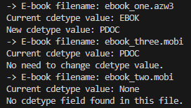

# ebook_cdetype_to_pdoc
A tiny script written in Python 3 for changing cdetype value to "PDOC" in selected e-book formats.

## Why?

There's a software bug in e-book readers made by most popular company in this area, which results in removing e-books in a very specific situation.

If you put your device into airplane mode for a long time and connect to the Internet afterwards, some e-books are automatically removed from your e-reader. It was discovered that this behaviour depends on *cdetype* metadata in a file, which is present in certain e-book formats. If a file has *EBOK* value in *cdetype* field, then it is deleted from a device in described scenario. Files with *PDOC* value and without such field at all seem to be safe from removing.

Issue has been known at least since October 2023, but producer of e-book readers hasn't fixed it until now. That's the reason I decided to make this small script for batch changing *cdetype* value to *PDOC*.

## How it works

It updates *cdetype* metadata to *PDOC* in each e-book, if this field doesn't have such value yet. Script leaves files without *cdetype* metadata present untouched as this change seems to be unnecessary for them.

## Installation

*ebook_cdetype_to_pdoc* requires Python 3 to run it, that's the basic prerequisite. I'll refer to Python 3 later simply as Python, so keep this in mind. *ebook_cdetype_to_pdoc.py* was tested on Python 3.13.1, but it should be fine with any future versions for a while.

The same rule applies to *mobi_header* package, but I recommend using it in version I used, that's *mobi_header 0.0.4*. I refer to this version in instructions below.

### On Windows

After having Python installed (if you don't have it yet, you can find it [there](https://www.python.org/downloads/)), you need to install extra package (*mobi_header*) from *pip* by typing in cmd/PowerShell/Terminal:

```
py -m pip install mobi_header==0.0.4
```

All other packages required by *mobi_header* will be downloaded and installed during that.

Then you just need to get *ebook_cdetype_to_pdoc.py* file from this repository.

### On Linux

On most Linux distributions Python is already installed, but it requires a few more steps as *pip* is not installed along with Python. I will use Ubuntu 22.04.2 as an example there.

Ubuntu has Python installed by default, so start with installing *pip*, a package installer for Python, by typing in Terminal (with sudo command):
```
apt-get install -y python3-pip
```

Then get *mobi_header* - a package from *pip* required for *ebook_cdetype_to_pdoc.py* to run:
```
python3 -m pip install mobi_header==0.0.4
```

Rest of the required by *mobi_header* packages will be installed alongside it.

Then all that is left is to download *ebook_cdetype_to_pdoc.py* from this repository.

## How to use

Just place the *ebook_cdetype_to_pdoc.py* file in the folder with your e-books and run it, that's all.

To see the progress and results of running script, it is advised to start the script from a command line.



For now *ebook_cdetype_to_pdoc* supports e-book files only with **.mobi* and **.azw3* extensions.

## Credits

This application is based on open source software, including:
- [Python](https://www.python.org/)
- [mobi-header](https://pypi.org/project/mobi-header/)

Many thanks to authors of all packages and libraries installed along with software mentioned above.

## Licence

*ebook_cdetype_to_pdoc* is licensed under the terms of the MIT License.